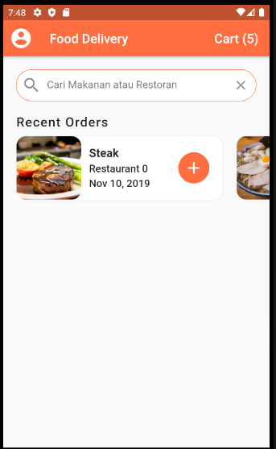

# food_delivery_ui

A new Flutter project.

## Getting Started

```bash
# create project
flutter create food_delivery_ui
```

## Progress

1. Appbar
<p align="center">
  
</p>

2. Adding Recent Orders
<p align="center">
  
</p>

## Hasil Akhir

1. Halaman Depan
<p align="center">
  
</p>
2. Halaman Detail
<p align="center">
  
</p>
3. Halaman Cart
<p align="center">
  
</p>

## Triks

- ketikan stf untuk membuat shortcut stateles full dan stt untuk state less

This project is a starting point for a Flutter application.

A few resources to get you started if this is your first Flutter project:

- [Lab: Write your first Flutter app](https://flutter.dev/docs/get-started/codelab)
- [Cookbook: Useful Flutter samples](https://flutter.dev/docs/cookbook)

For help getting started with Flutter, view our
[online documentation](https://flutter.dev/docs), which offers tutorials,
samples, guidance on mobile development, and a full API reference.
