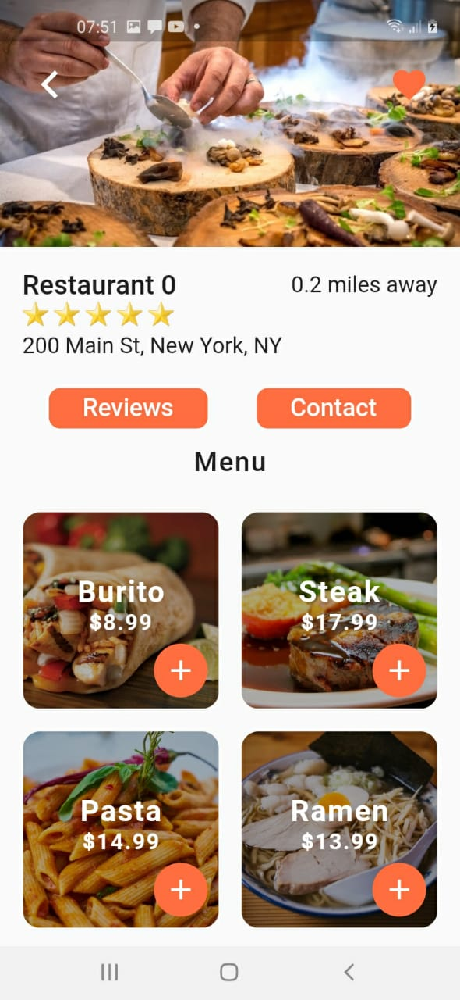

# food_delivery_ui

A new Flutter project.

## Getting Started

```bash
# create project
flutter create food_delivery_ui
```

## Hasil Akhir

1. Halaman Depan
<p align="center">
  
</p>
2. Halaman Detail
<p align="center">
  
</p>
3. Halaman Cart
<p align="center">
  
</p>

## Data dan Models

data-data dummy yang kita gunakan akan didefinisikan sebagai sebuah objek kelas, masing-masing kelas tersebut adalah food, order, restaurant dan user.

1. food

```dart
class Food {
  final String imageUrl;
  final String name;
  final double price;

  Food({this.imageUrl, this.name, this.price});
}
```

2. order

```dart
import 'package:food_delivery_ui/models/food.dart';
import 'package:food_delivery_ui/models/restaurant.dart';

class Order {
  final Restaurant restaurant;
  final Food food;
  final String date;
  final int quantity;

  Order({this.date, this.restaurant, this.food, this.quantity});
}

```

3. restaurant

```dart
import 'package:food_delivery_ui/models/food.dart';

class Restaurant {
  final String imageUrl;
  final String name;
  final String address;
  final int rating;
  final List<Food> menu;

  Restaurant({this.imageUrl, this.name, this.address, this.rating, this.menu});
}

```

4. user

```dart
import 'package:food_delivery_ui/models/order.dart';

class User {
  final String name;
  final List<Order> orders;
  final List<Order> cart;

  User({this.name, this.orders, this.cart});
}

```

5. data

```dart
// Food
import 'package:food_delivery_ui/models/food.dart';
import 'package:food_delivery_ui/models/order.dart';
import 'package:food_delivery_ui/models/restaurant.dart';
import 'package:food_delivery_ui/models/user.dart';

final _burito =
    Food(imageUrl: 'assets/images/burrito.jpg', name: 'Burito', price: 8.99);
final _steak =
    Food(imageUrl: 'assets/images/steak.jpg', name: 'Steak', price: 17.99);
final _pasta =
    Food(imageUrl: 'assets/images/pasta.jpg', name: 'Pasta', price: 14.99);
final _ramen =
    Food(imageUrl: 'assets/images/ramen.jpg', name: 'Ramen', price: 13.99);
final _pancakes =
    Food(imageUrl: 'assets/images/pancakes.jpg', name: 'Pancakes', price: 9.99);
final _burger =
    Food(imageUrl: 'assets/images/burger.jpg', name: 'Burger', price: 14.99);
final _pizza =
    Food(imageUrl: 'assets/images/pizza.jpg', name: 'Pizza', price: 8.99);
final _salmon = Food(
    imageUrl: 'assets/images/salmon.jpg', name: 'Salmon Salad', price: 17.99);

// Restaurant
final _restaurant0 = Restaurant(
  imageUrl: 'assets/images/restaurant0.jpg',
  name: 'Restaurant 0',
  address: '200 Main St, New York, NY',
  rating: 5,
  menu: [_burito, _steak, _pasta, _ramen, _pancakes, _burger, _pizza, _salmon],
);

final _restaurant1 = Restaurant(
  imageUrl: 'assets/images/restaurant1.jpg',
  name: 'Restaurant 0',
  address: '200 Main St, New York, NY',
  rating: 5,
  menu: [
    _steak,
    _pasta,
    _ramen,
    _pancakes,
    _burger,
    _pizza,
  ],
);

final _restaurant2 = Restaurant(
  imageUrl: 'assets/images/restaurant2.jpg',
  name: 'Restaurant 0',
  address: '200 Main St, New York, NY',
  rating: 5,
  menu: [_steak, _pasta, _pancakes, _burger, _pizza, _salmon],
);

final _restaurant3 = Restaurant(
  imageUrl: 'assets/images/restaurant3.jpg',
  name: 'Restaurant 0',
  address: '200 Main St, New York, NY',
  rating: 5,
  menu: [_burito, _steak, _burger, _pizza, _salmon],
);

final _restaurant4 = Restaurant(
  imageUrl: 'assets/images/restaurant4.jpg',
  name: 'Restaurant 0',
  address: '200 Main St, New York, NY',
  rating: 5,
  menu: [_burito, _ramen, _pancakes, _burger, _salmon],
);

final List<Restaurant> restaurants = [
  _restaurant0,
  _restaurant1,
  _restaurant2,
  _restaurant3,
  _restaurant4,
];

// User
final currentUser = User(name: 'Frika', orders: [
  Order(
    date: 'Nov 10, 2019',
    food: _steak,
    restaurant: _restaurant2,
    quantity: 1,
  ),
  Order(
    date: 'Nov 8, 2019',
    food: _ramen,
    restaurant: _restaurant0,
    quantity: 3,
  ),
  Order(
    date: 'Nov 5, 2019',
    food: _burito,
    restaurant: _restaurant3,
    quantity: 2,
  ),
  Order(
    date: 'Nov 2, 2019',
    food: _salmon,
    restaurant: _restaurant3,
    quantity: 1,
  ),
  Order(
    date: 'Nov 1, 2019',
    food: _pancakes,
    restaurant: _restaurant4,
    quantity: 1,
  ),
], cart: [
  Order(
      date: 'Nov 11, 2019',
      food: _burger,
      restaurant: _restaurant2,
      quantity: 2),
  Order(
      date: 'Nov 11, 2019',
      food: _pasta,
      restaurant: _restaurant2,
      quantity: 1),
  Order(
      date: 'Nov 11, 2019',
      food: _salmon,
      restaurant: _restaurant3,
      quantity: 1),
  Order(
      date: 'Nov 11, 2019',
      food: _pancakes,
      restaurant: _restaurant4,
      quantity: 3),
  Order(
      date: 'Nov 11, 2019',
      food: _burito,
      restaurant: _restaurant1,
      quantity: 2)
]);
```

## App Bar dan Search

<p align="center">
  
</p>

```dart
// home_screen.art
// appbar
appBar: AppBar(
  leading: IconButton(
    icon: Icon(Icons.account_circle),
    iconSize: 36.0,
    onPressed: () {},
  ),
  title: Text("Food Delivery"),
  actions: <Widget>[
    FlatButton(
        child: Text('Cart (${currentUser.cart.length})',
            style: TextStyle(color: Colors.white, fontSize: 20.0)),
        onPressed: () => Navigator.push(
              context,
              MaterialPageRoute(
                builder: (_) => CartScreen(),
              ),
            )),
  ],
)

// search
Padding(
  padding: EdgeInsets.all(20.0),
  child: TextField(
    decoration: InputDecoration(
      contentPadding: EdgeInsets.symmetric(vertical: 15.0),
      fillColor: Colors.white,
      filled: true,
      border: OutlineInputBorder(
          borderRadius: BorderRadius.circular(30.0),
          borderSide: BorderSide(width: 0.8)),
      enabledBorder: OutlineInputBorder(
          borderRadius: BorderRadius.circular(30.0),
          borderSide: BorderSide(
              width: 0.8, color: Theme.of(context).primaryColor)),
      hintText: "Cari Makanan atau Restoran",
      prefixIcon: Icon(
        Icons.search,
        size: 30.0,
      ),
      suffixIcon: IconButton(
        icon: Icon(Icons.clear),
        onPressed: () {},
      ),
    ),
  ),
),

```

## Triks

- ketikan stf untuk membuat shortcut stateles full dan stt untuk state less

This project is a starting point for a Flutter application.

A few resources to get you started if this is your first Flutter project:

- [Lab: Write your first Flutter app](https://flutter.dev/docs/get-started/codelab)
- [Cookbook: Useful Flutter samples](https://flutter.dev/docs/cookbook)

For help getting started with Flutter, view our
[online documentation](https://flutter.dev/docs), which offers tutorials,
samples, guidance on mobile development, and a full API reference.
