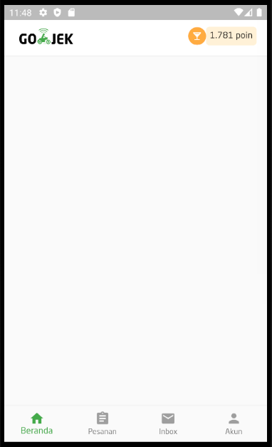

# gojek_ui

A new Flutter project.

## Getting 
```bash
# create project
flutter create gojek_ui
```

## Result
1. part 1 [bottom navbar dan appbar]
<p align="center">
  
</p>

This project is a starting point for a Flutter application.

A few resources to get you started if this is your first Flutter project:
- [gojek ui - tutorial](https://medium.com/@riz_maulana/membangun-landing-page-aplikasi-go-jek-dengan-flutter-sdk-bagian-1-3-531d0cd537db)
- [Lab: Write your first Flutter app](https://flutter.dev/docs/get-started/codelab)
- [Cookbook: Useful Flutter samples](https://flutter.dev/docs/cookbook)
- [Download neo sans font](https://www.dafontfree.co/neo-sans-font-free-download/)

For help getting started with Flutter, view our
[online documentation](https://flutter.dev/docs), which offers tutorials,
samples, guidance on mobile development, and a full API reference.
